# Guide d'implémentation : Authentification Keycloak avec Expo React Native

## Vue d'ensemble

Ce guide détaille l'implémentation de l'authentification Keycloak dans une application Expo React Native avec support web, incluant la persistance sécurisée des tokens et la reconnexion automatique.

## Architecture générale

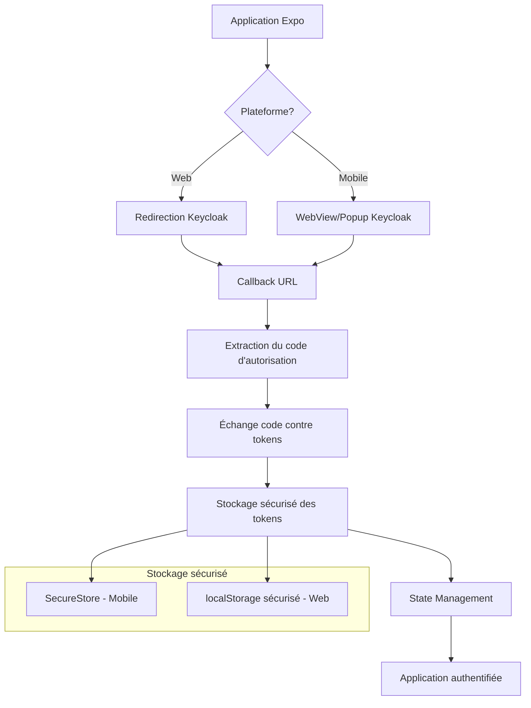

## Étapes d'implémentation

### 1. Configuration et dépendances

#### Librairies nécessaires

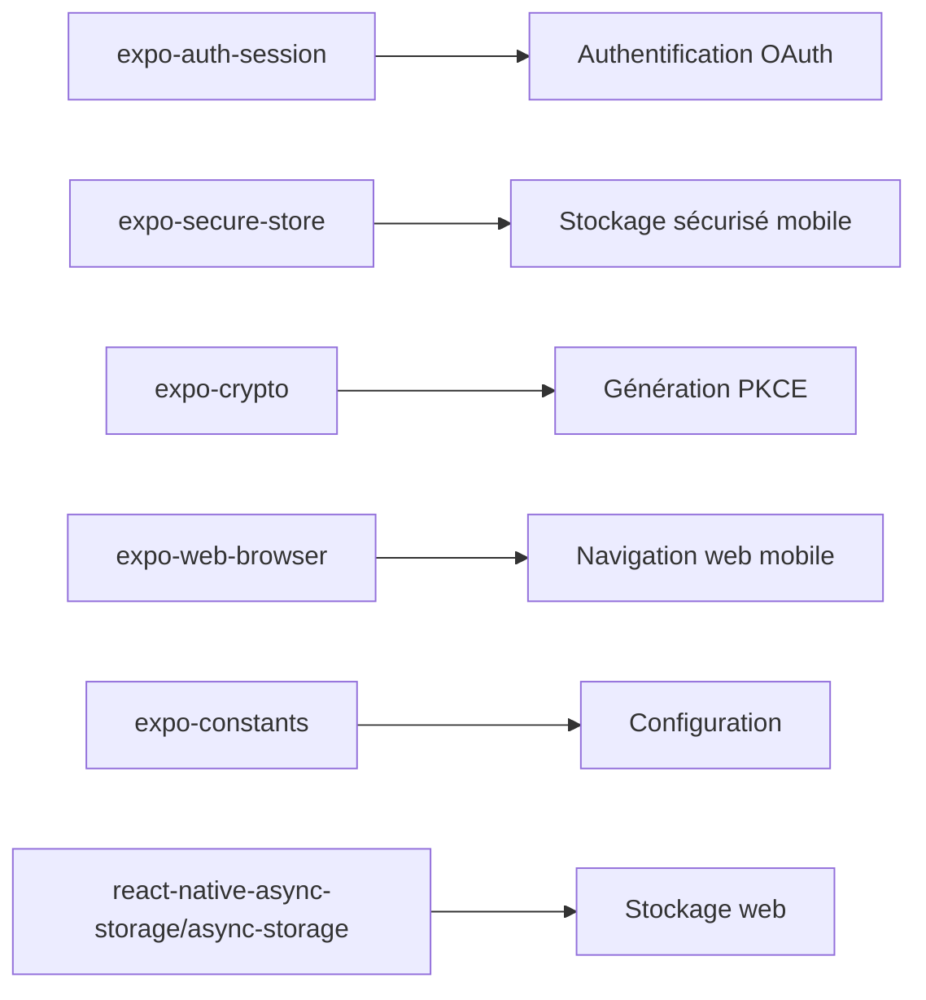

**Commandes d'installation :**

- `npx expo install expo-auth-session expo-secure-store expo-crypto expo-web-browser @react-native-async-storage/async-storage`

#### Configuration Keycloak

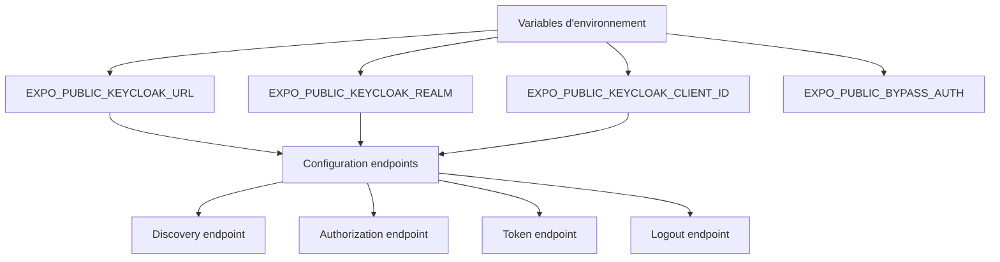

### 2. Configuration des redirections

#### Expo Router + Deep Links

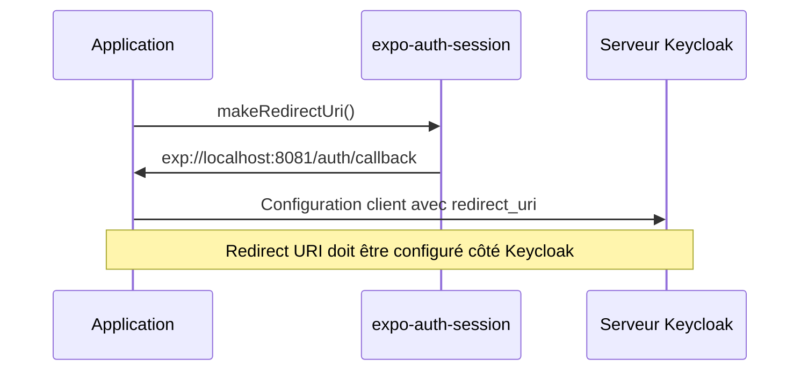

**Configuration requise :**

- `app.json/app.config.js` : Configuration du scheme
- Route Expo Router : `app/auth/callback.tsx`
- Configuration Keycloak : Ajout des redirect URIs

### 3. Flux d'authentification

#### Flux PKCE (Proof Key for Code Exchange)

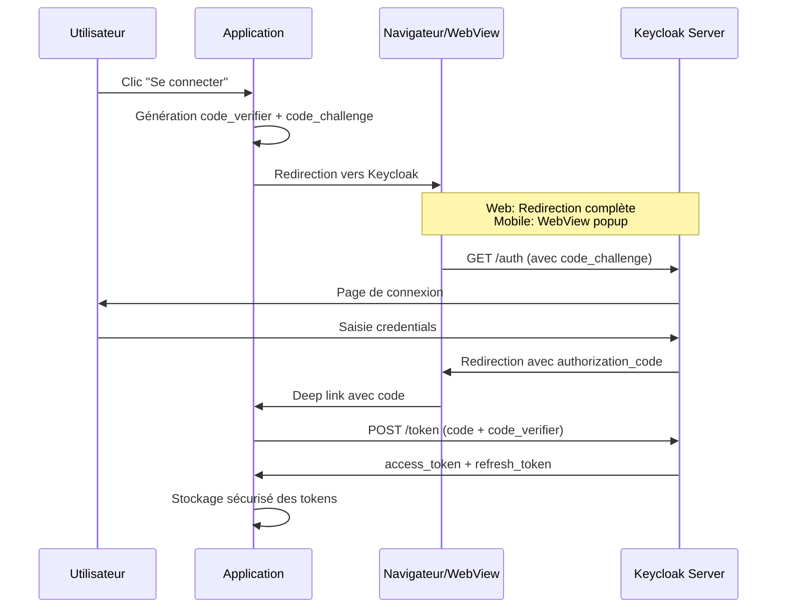

#### Différences plateforme

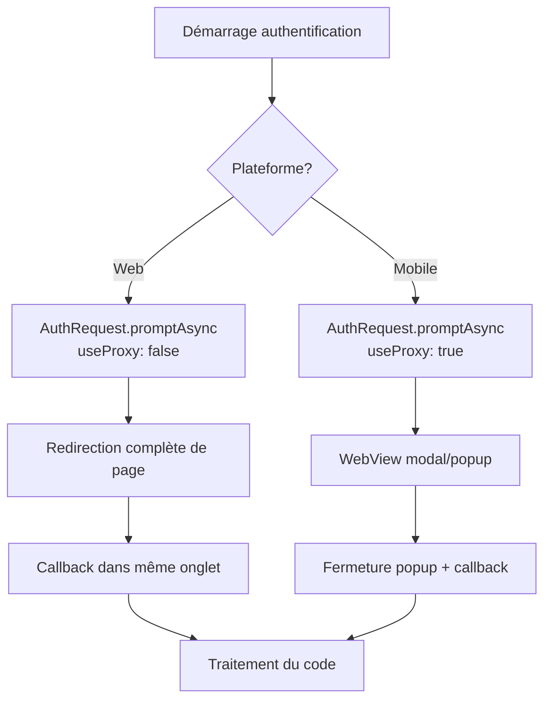

### 4. Gestion sécurisée des tokens

#### Stockage sécurisé multi-plateforme

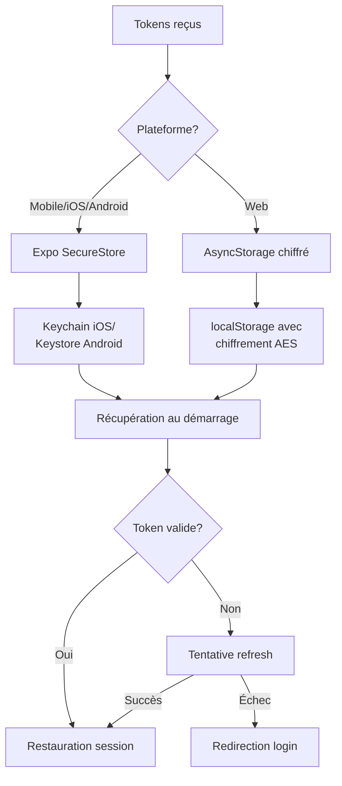

#### Structure de stockage

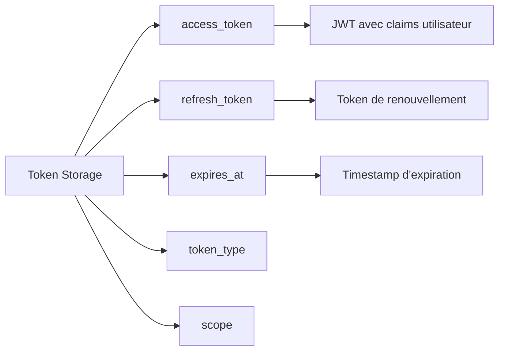

### 5. Gestion du cycle de vie des tokens

#### Auto-refresh et persistance de session

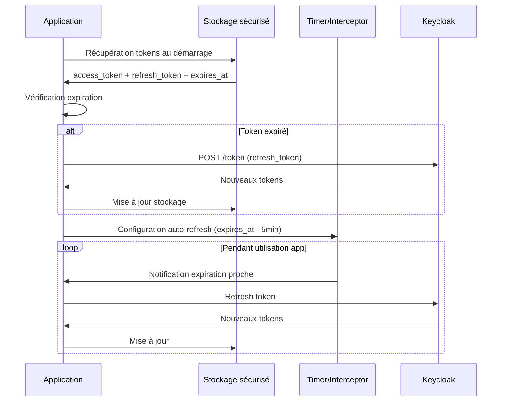

### 6. Architecture des composants

#### Structure des hooks et contexte

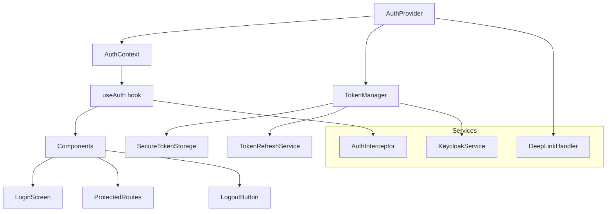

### 7. Gestion des erreurs et edge cases

#### Flux de gestion d'erreurs

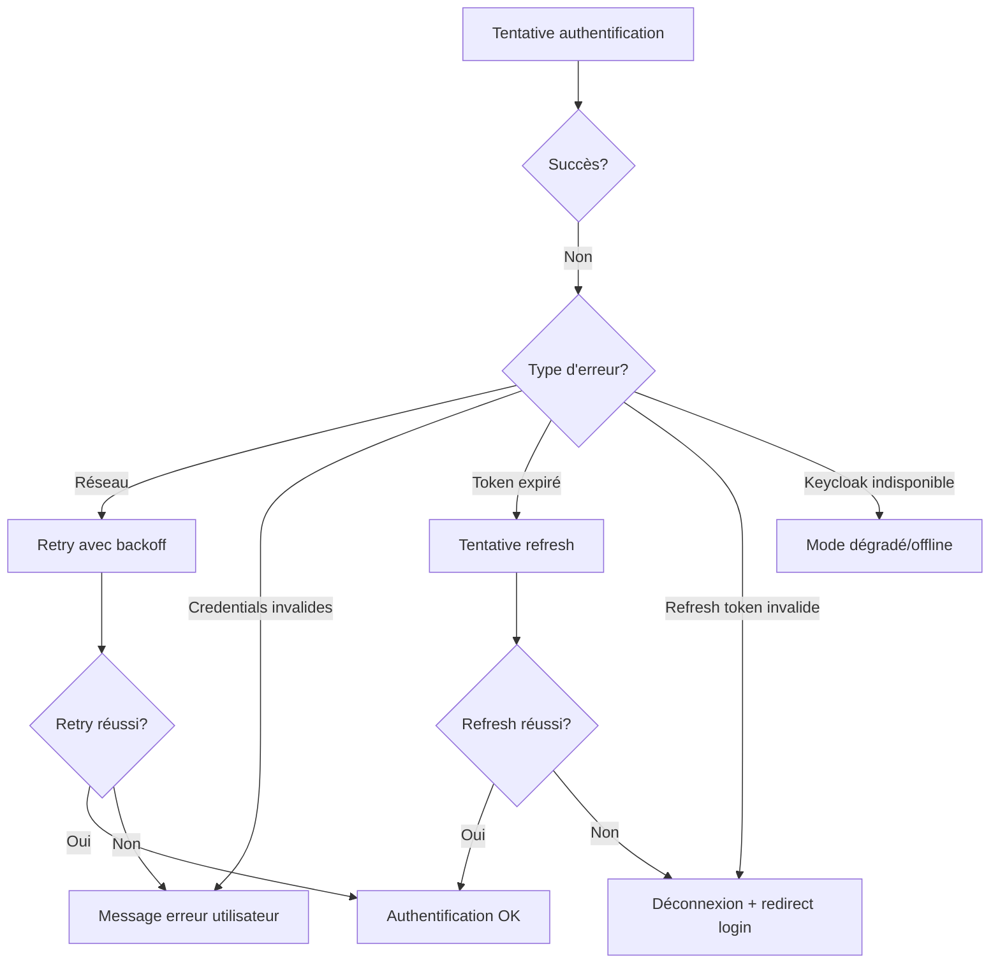

### 8. Configuration Expo Router

#### Structure des routes protégées

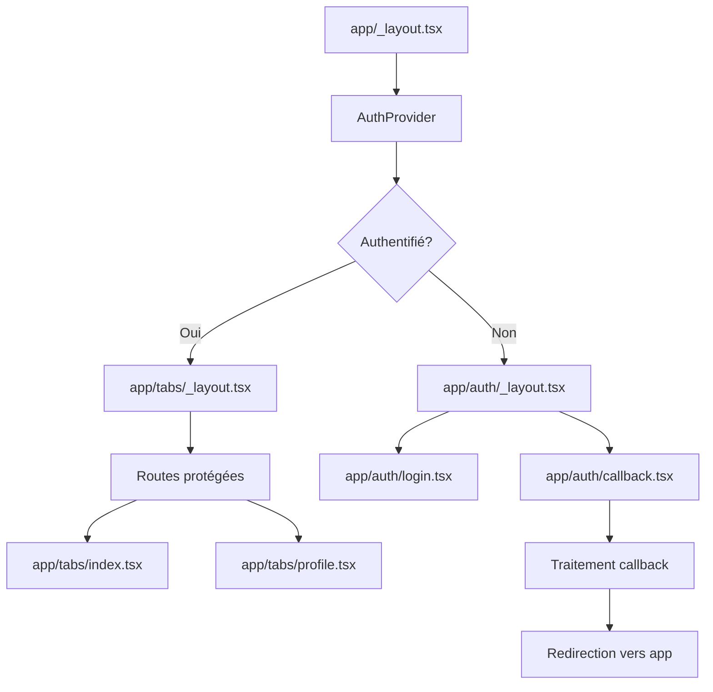

### 9. Bonnes pratiques de sécurité

#### Checklist de sécurité

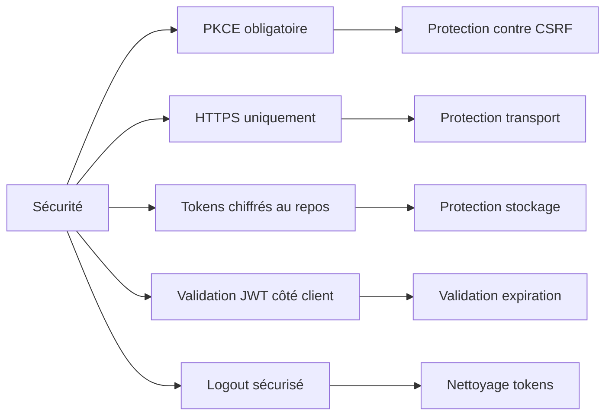

### 10. Configuration de production

#### Variables d'environnement par environnement

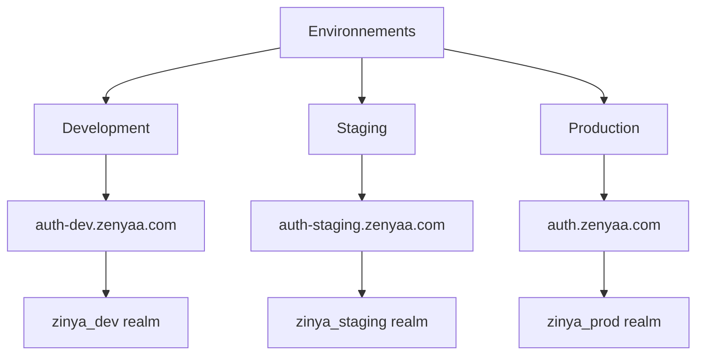

## Points d'attention spécifiques

### Web vs Mobile

1. **Web** : Redirection complète, pas de popup
2. **Mobile** : WebView avec retour à l'app via deep link
3. **Stockage** : SecureStore (mobile) vs AsyncStorage chiffré (web)

### Expo Router Integration

1. Configuration des routes de callback
2. Gestion des deep links
3. Protection des routes authentifiées
4. Navigation conditionnelle

### Performance

1. Chargement asynchrone des tokens au démarrage
2. Mise en cache des informations utilisateur
3. Pré-validation des tokens avant requêtes API
4. Optimisation des re-renders avec useMemo/useCallback

## Ressources et documentation

- [Expo AuthSession](https://docs.expo.dev/versions/latest/sdk/auth-session/)
- [Expo SecureStore](https://docs.expo.dev/versions/latest/sdk/securestore/)
- [Keycloak OAuth2 Flow](https://www.keycloak.org/docs/latest/securing_apps/#_oidc)
- [PKCE RFC](https://tools.ietf.org/html/rfc7636)

Ce guide fournit une base solide pour implémenter l'authentification Keycloak avec toutes les exigences spécifiées, en respectant les bonnes pratiques de sécurité et l'expérience utilisateur optimale sur chaque plateforme.
